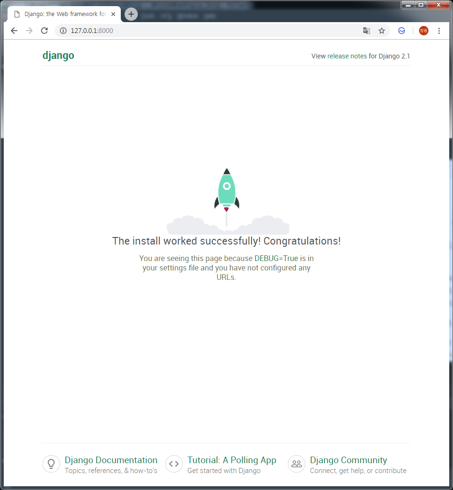

Django Project 시작하기
===

# 1. Django Project 생성
```bash
$ django-admin start mysite .
$ tree
.
│  manage.py
│
└─mysite
        settings.py
        urls.py
        wsgi.py
        __init__.py
```

# 2. 기본설정
## 2.1. 타임존 설정하기
```bash
# mysite/settings.py
TIME_ZONE = 'Asia/Seoul'
```
## 2.2. 정적파일 위치 설정하기
```bash
# mysite/settings.py
STATIC_URL = '/static/'
STATIC_ROOT = os.path.join(BASE_DIR, 'static')
```
## 2.3. 데이터베이스 설정하기
```bash
# mysite/settings.py
DATABASES = {
    'default': {
        'ENGINE': 'django.db.backends.sqlite3',
        'NAME': os.path.join(BASE_DIR, 'db.sqlite3'),
    }
}
```
## 2.4. 데이터베이스 생성하기
```bash
$ python manage.py migrate
Operations to perform:
  Apply all migrations: admin, auth, contenttypes, sessions
Running migrations:
  Applying contenttypes.0001_initial... OK
  Applying auth.0001_initial... OK
  Applying admin.0001_initial... OK
  Applying admin.0002_logentry_remove_auto_add... OK
  Applying admin.0003_logentry_add_action_flag_choices... OK
  Applying contenttypes.0002_remove_content_type_name... OK
  Applying auth.0002_alter_permission_name_max_length... OK
  Applying auth.0003_alter_user_email_max_length... OK
  Applying auth.0004_alter_user_username_opts... OK
  Applying auth.0005_alter_user_last_login_null... OK
  Applying auth.0006_require_contenttypes_0002... OK
  Applying auth.0007_alter_validators_add_error_messages... OK
  Applying auth.0008_alter_user_username_max_length... OK
  Applying auth.0009_alter_user_last_name_max_length... OK
  Applying sessions.0001_initial... OK

```
## 2.5. Django 웹 서버 실행
```bash
$ python manage.py runserver
Performing system checks...

System check identified no issues (0 silenced).
February 26, 2019 - 23:21:57
Django version 2.1.7, using settings 'mysite.settings'
Starting development server at http://127.0.0.1:8000/
Quit the server with CTRL-BREAK.
```

