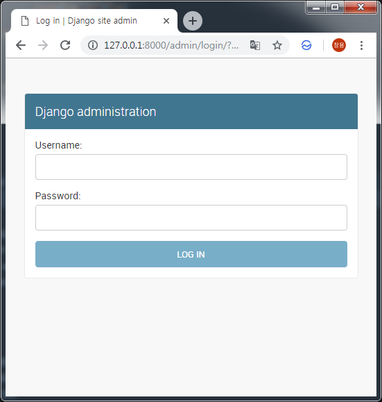
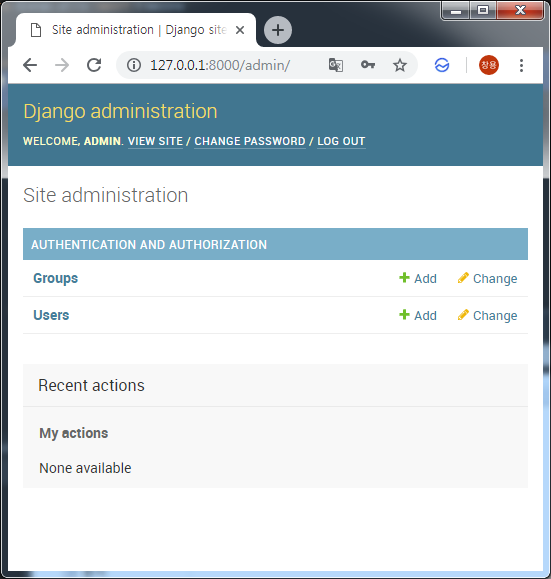

Django 관리자(admin) 만들기
===

# 1. Django admin 생성
```bash
python manage.py createsuperuser
Username: admin
Email address:
Password:
Password (again):
Superuser created successfully.
```

# 2. 관리자 페이지 접속
## 2.1. Django 웹 서버 실행
```bash
$ python manage.py runserver
Performing system checks...

System check identified no issues (0 silenced).
February 27, 2019 - 16:00:37
Django version 2.1.7, using settings 'mysite.settings'
Starting development server at http://127.0.0.1:8000/
Quit the server with CTRL-BREAK
```


## 2.2. 브라우저로 윕 서버 관리자페이지 접속
* [HOSTNAME]/admin/ 접속



