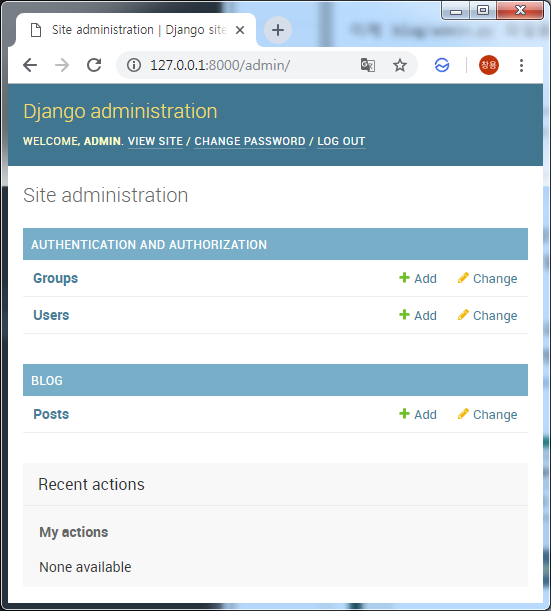
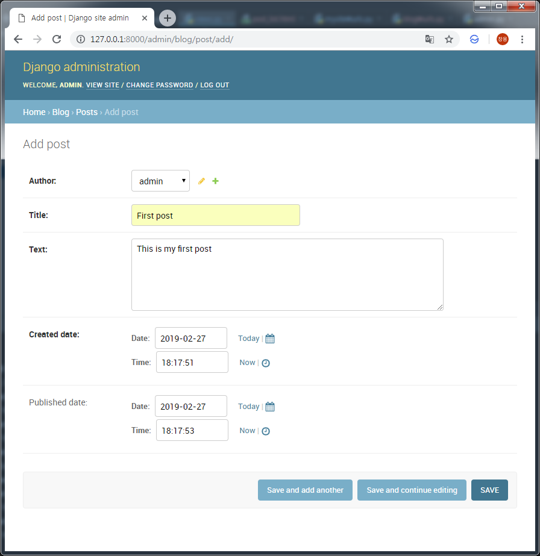

Django 블로그를 위한 Application/Model 만들기
===
 장고는 기능별로 모듈로 관리하게 되는데 이를 어플리케이션이라고 부릅니다. 각 어플리케이션은 필요에 따라 지정된 데이터베이스 테이블에 접근하게 되는데 이를 위해 모델이라는 파이썬 객체를 사용합니다. 이번 포스트에서는 블로그 관리를 위한 어플리케이션과 모델을 만들어 보겠습니다.
# 1. Django Application 생성
## 1.1. Django "blog" App 생성
```bash
 $ python manage.py startapp blog
 $ tree
 .
│  .gitignore
│  db.sqlite3
│  manage.py
│
├─blog
│  │  admin.py
│  │  apps.py
│  │  models.py
│  │  tests.py
│  │  views.py
│  │  __init__.py
│  │
│  └─migrations
│          __init__.py
│
└─mysite
    │  settings.py
    │  urls.py
    │  wsgi.py
    │  __init__.py
    │
    └─__pycache__
```
## 1.2. "blog" App 세팅파일에 등록
```python
# mysite/settings.py
INSTALLED_APPS = [
    'django.contrib.admin',
    'django.contrib.auth',
    'django.contrib.contenttypes',
    'django.contrib.sessions',
    'django.contrib.messages',
    'django.contrib.staticfiles',
    'blog',
]
```
# 2. Django 포스팅을 위한 Model 생성
## 2.1. Model 코드 작성
```python
# blog/models.py
from django.db import models
from django.utils import timezone


class Post(models.Model):
    author = models.ForeignKey('auth.User', on_delete=models.CASCADE)
    title = models.CharField(max_length=200)
    text = models.TextField()
    created_date = models.DateTimeField(
            default=timezone.now)
    published_date = models.DateTimeField(
            blank=True, null=True)

    def publish(self):
        self.published_date = timezone.now()
        self.save()

    def __str__(self):
        return self.title
```
## 2.2. Model 생성
```bash
$ python manage.py makemigrations blog
Migrations for 'blog':
  blog\migrations\0001_initial.py
    - Create model Post
```
## 2.3. Model과 매핑되는 DB Table생성
```bash
$ python manage.py migrate blog
Operations to perform:
  Apply all migrations: blog
Running migrations:
  Applying blog.0001_initial... OK
```

## 2.4. 관리자가 접근 할 수 있도록 수정
```python
# blog/admin.py
from django.contrib import admin
from .models import Post

admin.site.register(Post)
```
## 2.5. 관리자 페이지에서 확인


 