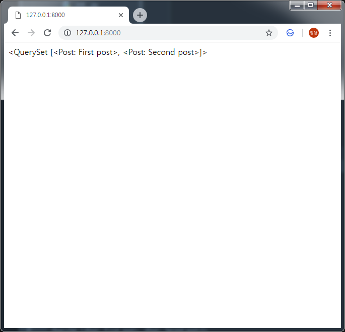

Django 블로그를 위한 View 만들기
===
 뷰는 모델로 부터 데이터를 가져와 유저가 원하는 정보로 가공해서 템플릿으로 전달하거나 반대로 유저가 템플릿에서 입력한 데이터를 가공해서 새로운 정보를 생성하거나 모델에 저장하는 역할을 합니다. 이번 포스트에서는 모델로부터 포스트 데이터를 가져와 간단한 템플릿에 출력해주는 뷰를 만들어 보겠습니다.
# 1. Django View 생성
## 1.1. Post 모델에서 데이터를 가져와 post_list.html 템플릿으로 전달하는 함수 작성
```python
# blog/views.py
from django.shortcuts import render
from django.utils import timezone
from .models import Post

def post_list(request):
    posts = Post.objects.filter(published_date__lte=timezone.now()).order_by('published_date')
    return render(request, 'blog/post_list.html', {'posts': posts})
```
# 2. 간단한 Template 코드 작성
```xml
# blog/templates/blog/post_list.html
{{ posts }}
```

# 3. Url 코드 작성
## 3.1. blog/url.py에서 Url을 설정할 수 있도록 포인팅
```python
# mysite/urls.py
from django.contrib import admin
from django.urls import path, include

urlpatterns = [
    path('admin/', admin.site.urls),
    path('', include('blog.urls')),
]
```

## 3.2. "http://[HOSTNAME]/" 접속시 post_list 함수가 실행되도록 설정
```python
# blog/urls.py
from django.urls import path
from . import views

urlpatterns = [
    path('', views.post_list, name='post_list'),
]
```
# 4. 결과 확인
