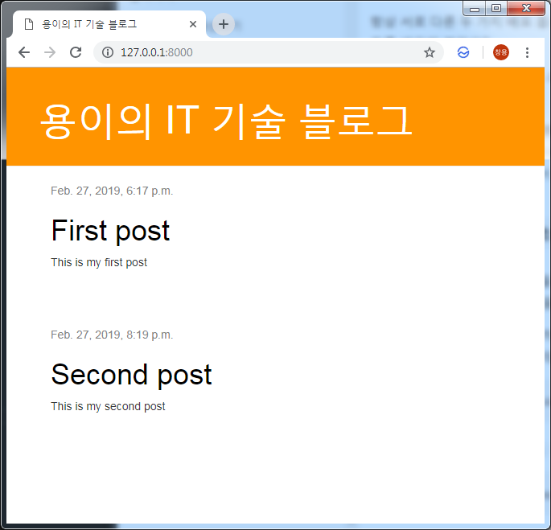

Django 블로그를 위한 Template 만들기
===
 이번 포스트에서는 CSS와 Bootstrap을 연동하여 깔끔하고 구체적인 템플릿을 만들어 보겠습니다.
 # 1. HTML body 수정 및 Bootstrap 링크 추가
```xml
# blog/templates/blog/post_list.html

<html>
    <head>
        <title>용이의 IT 기술 블로그</title>
        <link rel="stylesheet" href="//maxcdn.bootstrapcdn.com/bootstrap/3.2.0/css/bootstrap.min.css">
        <link rel="stylesheet" href="//maxcdn.bootstrapcdn.com/bootstrap/3.2.0/css/bootstrap-theme.min.css">
        <link rel="stylesheet" href="">
    </head>
    <body>
        <div>
            <h1><a href="/">용이의 IT 기술 블로그</a></h1>
        </div>

        
            <div>
                <p>published: {{ post.published_date }}</p>
                <h1><a href="">{{ post.title }}</a></h1>
                <p>{{ post.text|linebreaksbr }}</p>
            </div>
        
    </body>
</html>
```

# 2. CSS 파일 작성
```css
.page-header {
    background-color: #ff9400;
    margin-top: 0;
    padding: 20px 20px 20px 40px;
}
.page-header h1, .page-header h1 a, .page-header h1 a:visited, .page-header h1 a:active {
    color: #ffffff;
    font-size: 36pt;
    text-decoration: none;
}
.content {
    margin-left: 40px;
}
.date {
    color: #828282;
}
.save {
    float: right;
}
.post-form textarea, .post-form input {
    width: 100%;
}
.top-menu, .top-menu:hover, .top-menu:visited {
    color: #ffffff;
    float: right;
    font-size: 26pt;
    margin-right: 20px;
}
.post {
    margin-bottom: 70px;
}
.post h1 a, .post h1 a:visited {
    color: #000000;
}
```

# 3. 결과 확인
