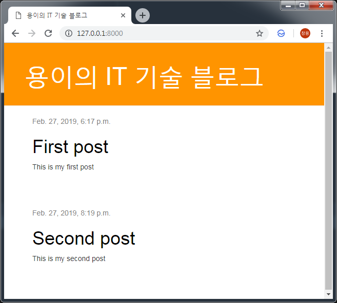

Django 블로그를 위한 Template 확장하기
===
 이번 포스트에서는 기본 템플릿과 포스트 템플릿을 나누어 재사용성을 높이는 방법을 알아보겠습니다.
 # 1. 기본 템플릿 생성하기
```xml
# blog/templates/blog/base.html

<html>
    <head>
        <title>Django Girls blog</title>
        <link rel="stylesheet" href="//maxcdn.bootstrapcdn.com/bootstrap/3.2.0/css/bootstrap.min.css">
        <link rel="stylesheet" href="//maxcdn.bootstrapcdn.com/bootstrap/3.2.0/css/bootstrap-theme.min.css">
        <link href='//fonts.googleapis.com/css?family=Lobster&subset=latin,latin-ext' rel='stylesheet' type='text/css'>
        <link rel="stylesheet" href="">
    </head>
    <body>
        <div class="page-header">
            <h1><a href="/">Django Girls Blog</a></h1>
        </div>

        <div class="content container">
            <div class="row">
                <div class="col-md-8">
                
                
                </div>
            </div>
        </div>
    </body>
</html>
```

 # 2. 기본 템플릿 확장하기
```xml
# blog/templates/blog/post_list.html



    
        <div class="post">
            <div class="date">
                {{ post.published_date }}
            </div>
            <h1><a href="">{{ post.title }}</a></h1>
            <p>{{ post.text|linebreaksbr }}</p>
        </div>
    

```

# 3. 결과 확인
