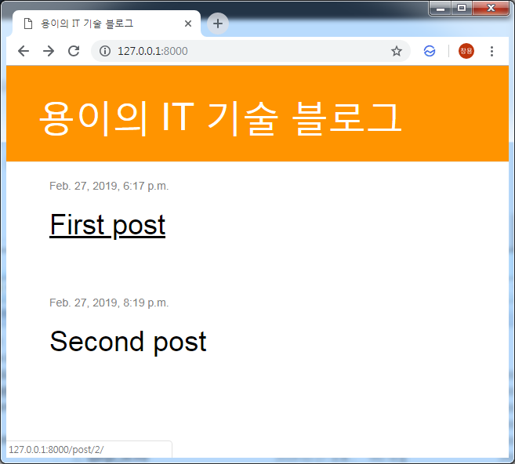
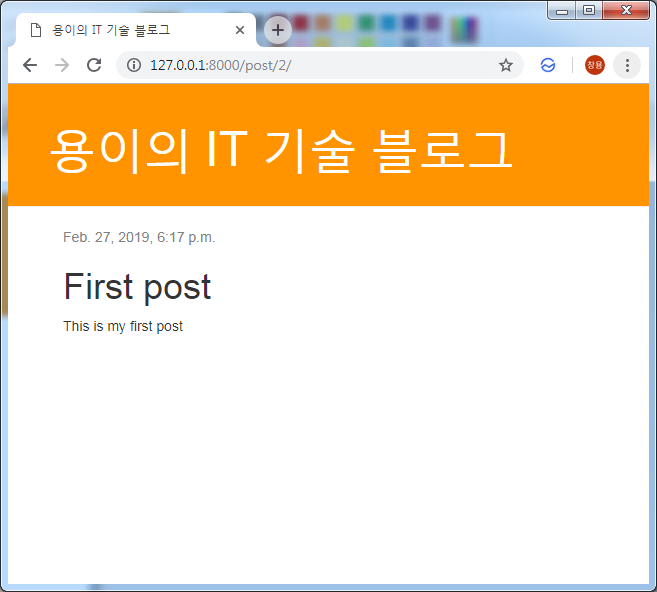

Django 블로그를 위한 Applicatoin 확장하기
===
 이번 포스트에서는 Application을 확장해서 페이지마다 하나의 포스트가 보이도록 수정해보겠습니다.
# 1. 기존 템플릿에 본문 삭제하고 제목에 링크 만들기
기존 템플릿의 본문은 삭제하고 제목만 리스트로 출력해서 메인페이지로 사용하겠습니다.
```xml
# blog/templates/blog/post_list.html



    
        <div class="post">
            <div class="date">
                {{ post.published_date }}
            </div>
            <h1><a href="">{{ post.title }}</a></h1>
        </div>
    

```

# 2. 포스트 상세 페이지를 위한 View 함수 추가
```python
# blog/view.pw
from django.shortcuts import render, get_object_or_404

def post_detail(request, pk):
    post = get_object_or_404(Post, pk=pk)
    return render(request, 'blog/post_detail.html', {'post': post})
```

# 3. 포스트 상세 페이지를 위한 템플릿 생성
```xml
# blog/templates/blog/post_detail.html



    <div class="post">
        
            <div class="date">
                {{ post.published_date }}
            </div>
        
        <h1>{{ post.title }}</h1>
        <p>{{ post.text|linebreaksbr }}</p>
    </div>

```

# 4. 포스트 상세 페이지를 위한 Url 코드 추가
```python
# blog/urls.py
from django.urls import path
from . import views

urlpatterns = [
    path('', views.post_list, name='post_list'),
    path('post/<int:pk>/', views.post_detail, name='post_detail'),
]
```
여기서 int:pk는 pk라는 int형 변수에 사용자가 입력한 값을 넣어 post_detail뷰에 전달하겠다는 뜻입니다. 

# 5. 결과 확인




## 3.2. "http://[HOSTNAME]/" 접속시 post_list 함수가 실행되도록 설정
```python
# blog/urls.py
from django.urls import path
from . import views

urlpatterns = [
    path('', views.post_list, name='post_list'),
]
```
