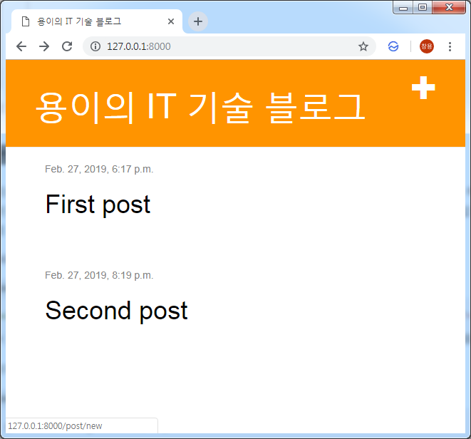
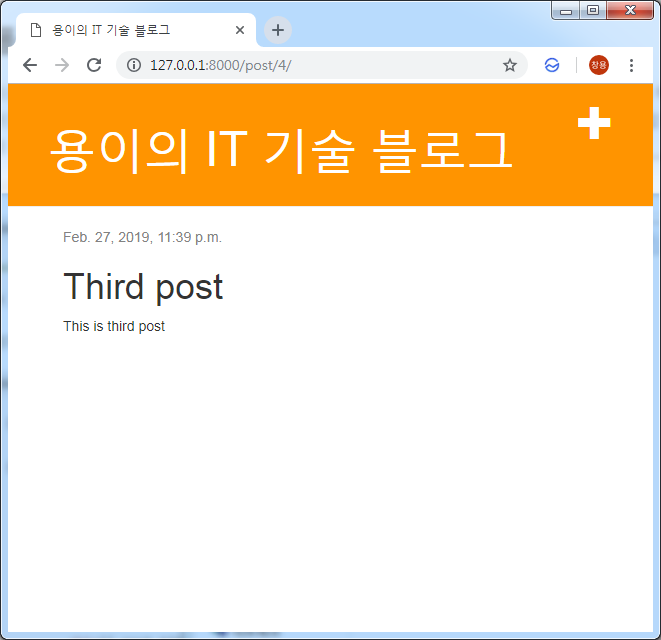
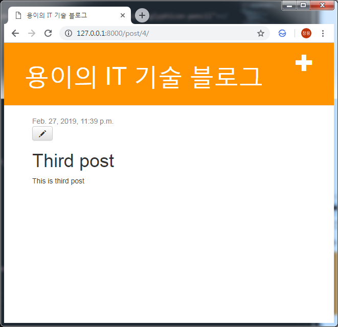
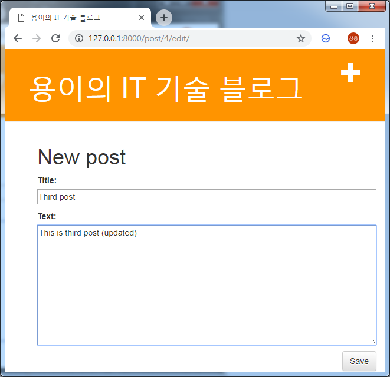
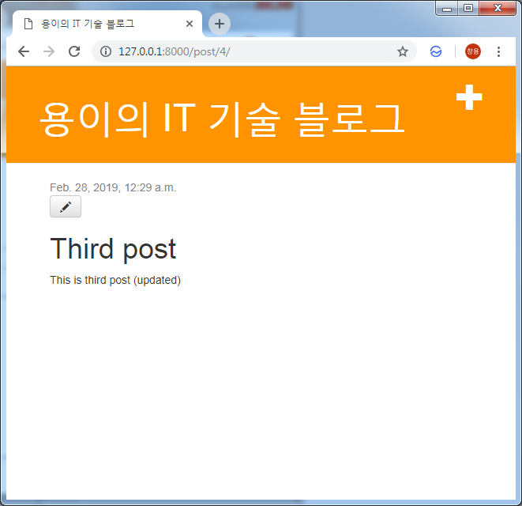

Django 블로그를 위한 Form 생성하기
===
 이번 포스트에서는 포스트를 생성하거나 수정을 위한 폼 페이지를 만들어 보겠습니다.
# 1. Base Template에 버튼 추가하기
```xml
# blog/templates/blog/base.html
<a href="" class="top-menu"><span class="glyphicon glyphicon-plus"></span></a>
```
```xml
# blog/templates/blog/base.html

<html>
    <head>
        <title>용이의 IT 기술 블로그</title>
        <link rel="stylesheet" href="//maxcdn.bootstrapcdn.com/bootstrap/3.2.0/css/bootstrap.min.css">
        <link rel="stylesheet" href="//maxcdn.bootstrapcdn.com/bootstrap/3.2.0/css/bootstrap-theme.min.css">
        <link rel="stylesheet" href="">
    </head>
    <body>
        <div class="page-header">
            <a href="" class="top-menu"><span class="glyphicon glyphicon-plus"></span></a>
            <h1><a href="/">용이의 IT 기술 블로그</a></h1>
        </div>

        <div class="content container">
            <div class="row">
                <div class="col-md-8">
                
                
                </div>
            </div>
        </div>
    </body>
</html>
```

# 2. Form 함수 생성하기
```python
# blog/form.py
from django import forms
from .models import Post

class PostForm(forms.ModelForm):
    class Meta:
        model = Post # 어떤 모델이 사용되어야 하는지 명시
        fields = ('title', 'text',) # 유저 입력이 필요한 필드
```
# 3. 포스트 추가를 위한 View 함수 추가
## 3.1. 폼 필드 생성을 위한 View 함수 코드 작성
```python
# blog/views.py
from .forms import PostForm

def post_new(request):
    form = PostForm()
    return render(request, 'blog/post_edit.html', {'form': form})
```

## 3.2. 유저에 의해 작성된 폼필드를 모델에 적용을 위한 View 함수 코드 수정
```python
# blog/views.py
from .forms import PostForm
from django.shortcuts import redirect

def post_new(request):
    if request.method == "POST":
        form = PostForm(request.POST)
        if form.is_valid():
            post = form.save(commit=False)
            post.author = request.user
            post.published_date = timezone.now()
            post.save()
            return redirect('post_detail', pk=post.pk)
    else:
        form = PostForm()
    return render(request, 'blog/post_edit.html', {'form': form})
``` 
 post_edit.html에서 사용자가 포스트를 작성한 뒤 버튼을 누르면 다시 post_new함수가 호출되게 됩니다. 때문에 어느시점에 호출되었는지 확인하기 위해 템플릿에서 request.method안에 "POST"를 의도적으로 넣어 전달해야합니다. 만약 "POST"라면 redirect를 호출해서 생성된 포스트의 상세 페이지로 이동합니다.

# 4. 폼 페이지를 위한 템플릿 생성
```xml
# blog/templates/blog/post_edit.html



    <h1>New post</h1>
    <form method="POST" class="post-form">
        {{ form.as_p }}
        <button type="submit" class="save btn btn-default">Save</button>
    </form>

```
 {{ form.as_p }}로 폼을 간단히 만들 수 있습니다. 또한, 폼 보안을 위해 를 추가해야합니다.

# 4. 폼 페이지를 위한 Url 코드 추가
```python
# blog/urls.py
from django.urls import path 
from . import views

urlpatterns = [
    path('', views.post_list, name='post_list'),
    path('post/<int:pk>/', views.post_detail, name='post_detail'),
    path('post/new/', views.post_new, name='post_new'),
]
```

# 5. 결과 확인




# 6. 폼 수정을 위한 View 함수 작성
```python
# blog/views.py
def post_edit(request, pk):
    post = get_object_or_404(Post, pk=pk)
    if request.method == "POST":
        form = PostForm(request.POST, instance=post)
        if form.is_valid():
            post = form.save(commit=False)
            post.author = request.user
            post.published_date = timezone.now()
            post.save()
            return redirect('post_detail', pk=post.pk)
    else:
        form = PostForm(instance=post)
    return render(request, 'blog/post_edit.html', {'form': form})
```
 위의 뷰는 get_object_or_404를 호출해서 모델로 부터 해당 pk를 하진 인스턴스를 가져오게 되고 이를 폼에 인자로 전달하게 됩니다. 그리고 기존에 만들어 놓았던 post_edit.html을 재사용하겠습니다.

# 7. 폼 수정을 위한 템플릿에 버튼 추가
```xml
# blog/templates/blog/post_detail.html
<a class="btn btn-default" href=""><span class="glyphicon glyphicon-pencil"></span></a>
```

```xml
# blog/templates/blog/post_detail.html



    <div class="post">
        
            <div class="date">
                {{ post.published_date }}
            </div>
        
        <a class="btn btn-default" href=""><span class="glyphicon glyphicon-pencil"></span></a>
        <h1>{{ post.title }}</h1>
        <p>{{ post.text|linebreaksbr }}</p>
    </div>

```

# 8. 폼 페이지를 위한 Url 코드 추가
```python
# blog/urls.py
path('post/<int:pk>/edit/', views.post_edit, name='post_edit'),
```

# 9. 결과 확인




# 10. 나에게만 추가/수정 버튼이 보이도록 수정
```xml
# blog/templates/blog/base.html

    <a href="" class="top-menu"><span class="glyphicon glyphicon-plus"></span></a>

```

```xml
# blog/templates/blog/post_detail.html

     <a class="btn btn-default" href=""><span class="glyphicon glyphicon-pencil"></span></a>

```