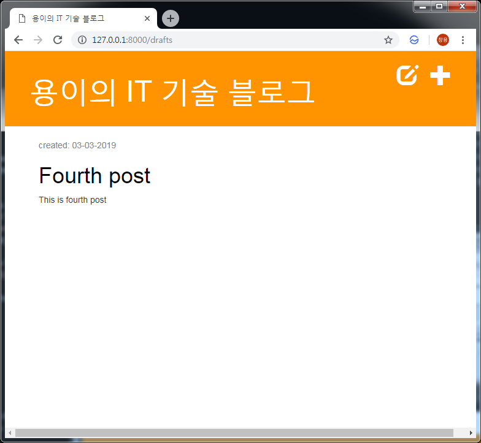

Django 임시저장 기능 만들기
===
 이번 포스트에서는 포스트를 생성하거나 수정 후 발행버튼을 눌러야만 포스트가 보이도록 수정해보겠습니다.
# 1. 생성, 수정시 발행시간이 현재시간으로 표시되는 부분 삭제
```python
# blog/views.py
def post_new(request):
...
            post.author = request.user
            post.published_date = timezone.now() # 삭제
            post.save()
...
def post_edit(request, pk):
...
            post.author = request.user
            post.published_date = timezone.now() # 삭제
            post.save()
...
```

# 2. 미발행된 포스트 목록 페이지 만들기
## 2.1. 기본 템플릿에 버튼 추가
```xml
# blog/templates/blog/base.html
            
                <a href="" class="top-menu"><span class="glyphicon glyphicon-plus"></span></a>
                <a href="" class="top-menu"><span class="glyphicon glyphicon-edit"></span></a> # 추가
            
```
## 2.2. View 함수 추가
```python
# blog/views.py
def post_draft_list(request):
    posts = Post.objects.filter(published_date__isnull=True).order_by('created_date')
    return render(request, 'blog/post_draft_list.html', {'posts': posts})
```

## 2.3. 관련 템플릿 생성
```xml
# blog/templates/blog/post_draft_list.html



    
        <div class="post">
            <p class="date">created: {{ post.created_date|date:'d-m-Y' }}</p>
            <h1><a href="">{{ post.title }}</a></h1>
            <p>{{ post.text|truncatechars:200 }}</p>
        </div>
    

```

## 2.4. Url 코드 추가
```python
# blog/urls.py
path('drafts', views.post_draft_list, name='post_draft_list'),
```

## 2.5. 결과 확인



# 3. 발행기능 만들기
## 3.1. 포스트 템플릿에 발행버튼 추가
```xml
# blog/templates/blog/post_detail.html

    <div class="date">
        {{ post.published_date }}
    </div>

    <a class="btn btn-default" href="">Publish</a>

```

## 3.2. View 함수 추가
```python
# blog/views.py
def post_publish(request, pk):
    post = get_object_or_404(Post, pk=pk)
    post.publish()
    return redirect('post_detail', pk=pk)
```

## 3.3. 모델에 발행일을 저장하는 함수 추가
```python
# blog/models.py
def publish(self):
    self.published_date = timezone.now()
    self.save()
```

## 3.4. Url 코드 추가
```python
# blog/urls.py
url(r'^post/(?P<pk>\d+)/publish/$', views.post_publish, name='post_publish'),
```
## 3.5. 결과 확인

