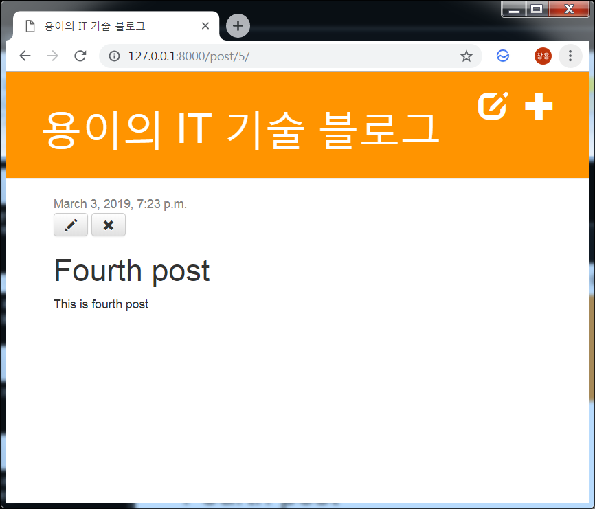

Django 블로그 포스트 삭제 기능 만들기
===
 이번 포스트에서는 포스트를 삭제하는 기능을 추가해보겠습니다.

# 1. 템플릿에 버튼 추가
```xml
# blog/templates/blog/post_detail.html
            
                <a href="" class="top-menu"><span class="glyphicon glyphicon-plus"></span></a>
                <a href="" class="top-menu"><span class="glyphicon glyphicon-edit"></span></a> # 추가
            
```
# 2. View 함수 추가
```python
# blog/views.py
def post_remove(request, pk):
    post = get_object_or_404(Post, pk=pk)
    post.delete()
    return redirect('post_list')
```

# 3. Url 코드 추가
```python
# blog/urls.py
url(r'^post/(?P<pk>\d+)/remove/$', views.post_remove, name='post_remove'),
```

## 4. 결과 확인
